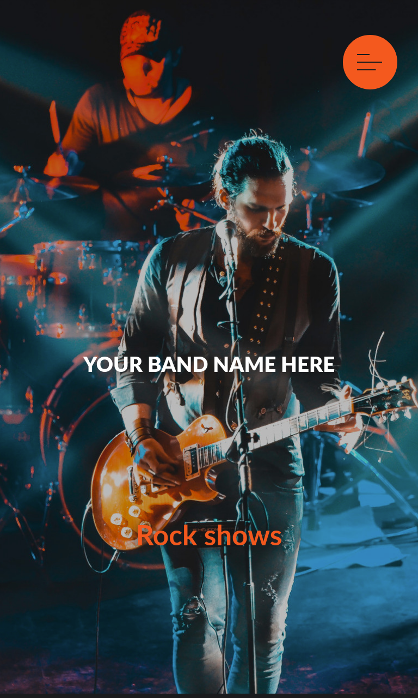

# :trollface: Free Rock Band Website Template :guitar:

<p align="center">
  
</p>
<p align="center">
  
</p>
<p align="center">
  
</p>


:point_right:[Show webpage here](https://gtcore902.github.io/free-rock-band-website-template/):metal:

## :free: You can use this template for your Rock Band web site !

### How to ?

:one:
```
mkdir <your directory>
git clone https://github.com/gtcore902/free-rock-band-website-template.git
```

:two: Updates in 'index.html' :
* 'alt' attributes for img tags
* input your band name in place of < your band name here >
* your band name in h1 / h2 tags
* your clip and clip name in video tag

:three: Update 'mainFunctions.js' file to input email address (line 55 / 56).

:four: To update yours social network accounts, modify lines 316 / 322 / 326 in the same file.

:five: Then you need to update these variables in 'sendFormContact.php' in your code editor to use form sections:
* $texte = "your site name" (line 11)
* $destinataire = "your email"
* $objet = "your band name"
* line 19 = "email from to send form" (you can choose any)
* $conf = "yours smtp informations"

:six: Do the same actions in 'sendFormSubscription.php' file.

That's all:exclamation:
Deploy this code on your server.

### :sunglasses: Want to contribute :question:

Fork this repository :stuck_out_tongue_winking_eye:
```
mkdir <your directory>
git clone https://github.com/gtcore902/free-rock-band-website-template.git
git checkout -b newfeature
git commit -am 'your feature'
git push origin newfeature
```
